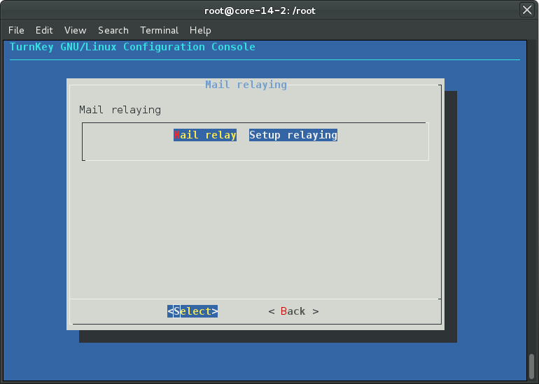

Confconsole - Mail relay
========================

.. contents::

Overview
--------

Confconsole Mail relay plugin allows, users to easily configure a remote
SMTP relay to send emails through. 

By default TurnKey Linux appliances send email directly. However to
provide more robust email delivery, it is highly recommended to use a
third party SMTP relay.

SendinBlue
----------

We have researched the available third party SMTP relay options and
have concluded that SendinBlue are currently providing the best mix
of features and value for money.

A free SendinBlue account allows sending up to 9000 emails per
month, so should provide sufficient capabilities for general 
low-medium email traffic use. If you wish to send mass-marketing
emails or are sending large volumes of transactional emails, you may
be better served by upgrading to a paid plan.

To sign up for a free SendinBlue account, please browse to:

https://hub.turnkeylinux.org/email/ 

You should only need to enter your Login (SendinBlue username) and
Password. The host and Port should be pre-configured within 
Confconsole.

Custom
------

The custom option allows you to configure your server to use an
alternate SMTP relay service. It should work with all avaialble SMTP
relays (public or private). 

Some additional configuration may be required for some SMTP relay
services. E.g. to use Google SMTP you need to adjust the config of
your account to allow "less secure applications". Please consult
with your remote SMTP relay provider for relevant details.

Deconfigure
-----------

This option removes all configuration and returns TurnKey to it's
default config.

Notes
-----

The SMTP relay authentication procedure requires the SMTP relay user
password to be stored in plain text at `/etc/postfix/sasl_passwd`
(readable only by root). As a general rule, so long as no other users
are granted read access, that should be sufficently secure. However,
if you have concerns about someone else (who has root access)
accessing this then you are advised to consider an alternate path.
